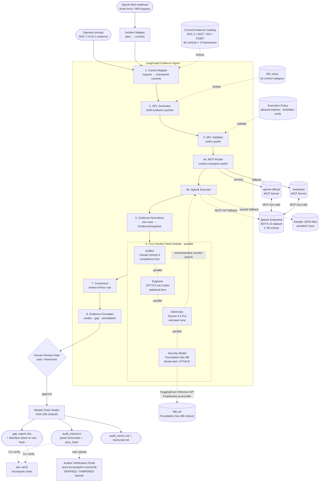

# Architecture

## The two technical differentiators

This isn't "generic LLM consensus with Splunk in the README." Two design choices set it apart:

1. **Four-Agent Panel Debate — Claude × GPT × Gemini × Foundation-Sec-8B.** Every finding is judged by four personas, *each running on a different model from a different vendor*: Auditor (Claude Sonnet 4, reads the control literally), Engineer (GPT-5, reads the SPL technically), Adversary (Gemini 2.5 Pro, tries to disprove the PASS verdict), Security Model (Foundation-Sec-8B, evaluates through a threat-intel lens). This is deliberate — disagreement between independently-trained models is meaningful signal; disagreement between same-model-different-prompts is performative. Foundation-Sec-8B is Cisco Foundation AI's open-weight security-specialized model, available via HuggingFace Inference API. Consensus rule: lowest verdict wins. The full debate transcript ships in `audit_trail.jsonl`. Graceful fallback to 3-persona panel when `HF_TOKEN` is missing, or single-vendor mode when only one vendor key is available.
2. **Merkle-chained Evidence Trail** — every snapshot in `audit_trail.jsonl` includes the SHA-256 hash of the previous snapshot. The final xlsx carries the chain root in a `Manifest` sheet. `aec verify gap_report.xlsx` recomputes the chain and detects any post-hoc edit to either artifact.

Together: the agent shows its work, and the work can't be silently rewritten.

## Pipeline (8 nodes + 2 guards, 1 graph)



A linear text view of the same pipeline:

```
operator prompt
      │
      ▼
1. Control Mapper      ← catalog.json (Control Evidence Catalog: SOC2/NIST/ISO)
      │
      ▼
2. SPL Generator       ← spl_hints (per control category)
      │
      ▼
3. SPL Validator       ← policy.json (allowed indexes, forbidden cmds, time bounds)
      │                  on reject → straight to formatter as gap finding
      ▼
4. Splunk Executor (MCP Router → splunk-official | livehybrid MCP servers → Splunk Enterprise w/ BOTS v3)
      │                  REST API fallback (--mcp rest), or sample fallback (--sample)
      │
      ▼
5. Evidence Normalizer → EvidenceSnapshot
      │
      ▼
6. Panel Debate        → 4 personas (Auditor / Engineer / Adversary / Security Model) in parallel
      │                  Adversary may emit counter-searches → loop back to (4) once
      ▼
7. Consensus           → lowest-of-panel verdict + transcript
      │
      ▼
8. Evidence Formatter  → passed-evidence row OR gap finding (severity-scored)
      │
      ▼
[Review Gate]          → auto (skip) or interactive (LangGraph interrupt)
      │
      ▼
[Merkle Chain Sealer]  → hashes every snapshot, embeds root in xlsx Manifest sheet
      │
      ▼
gap_report.xlsx  +  audit_package.md  +  audit_trail.jsonl  → all verifiable via `aec verify`
```

## Why these guards exist

- **SPL Validator** — the LLM can emit malformed counter-searches or destructive commands (`| delete`, `| outputlookup`). The validator enforces a minimal execution policy before adversary follow-up SPL hits the wire. Rejection is captured in the transcript with a clear reason.
- **Evidence Normalizer** — captures full provenance (control_id, exact SPL run, sourcetypes touched, row count, timestamp, LLM model + prompt id) into `audit_trail.jsonl`. Without this the agent's output isn't credible to an auditor.
- **Review Gate** — LangGraph `interrupt()` pauses for human approve/edit/reject. Off by default for demo speed; flip on with `--review=interactive` for the enterprise mode.
- **Panel Debate (task 007/020)** — four parallel LLM calls with distinct system prompts. The Adversary persona is the only one allowed to propose new counter-searches (one round of recurrence). The Security Model persona (Foundation-Sec-8B) evaluates evidence through a threat-intelligence lens, mapping controls to MITRE ATT&CK TTPs. Consensus is mechanical (lowest verdict wins) — no LLM "tiebreaker" in the critical path, so the result is reproducible. Personas are stored as plain-markdown system prompts in `src/aec/agent/personas/` so you can edit them without touching code.
- **Merkle Chain Sealer (task 008)** — pure SHA-256, no signing infra. Canonical JSON serialization (sorted keys, no whitespace, prev/this hash fields excluded from input). `aec verify` recomputes the chain and cross-checks the manifest root in the xlsx against the trail tip. Exit code 1 on any mismatch.

## Tech stack

| Layer | Choice | Why |
|---|---|---|
| Agent runtime | Python 3.11 + LangGraph | Splunk ecosystem is Python-first; LangGraph's stateful nodes map 1:1 to the pipeline and make HITL approval gates trivial |
| LLM | Claude Sonnet 4 (Anthropic SDK) | Highest reasoning quality for SPL synthesis + audit narrative |
| Splunk integration | Dual MCP Server (splunk-official + livehybrid) with REST API fallback | Both [splunk/mcp-server-for-splunk](https://github.com/splunk/mcp-server-for-splunk) and [livehybrid/splunk-mcp](https://github.com/livehybrid/splunk-mcp) behind a runtime router; `--mcp rest` bypasses MCP for direct REST |
| Splunk runtime | Live Splunk Enterprise + BOTS v3 (default), or pre-canned sample snapshots as fallback | Live path is the demo default; `--sample` flag available for offline/quick runs |
| Output | openpyxl → real vCISO audit template | Auditors recognize the format instantly |
| Priors | JSON, hand-curated from 89 vCISO templates | The "I lived this" unfair advantage |

## Priors layer

`src/aec/priors/catalog.json` is built once from the AccessQuint vCISO source templates (a local-only directory, NOT committed) by running:

```bash
python -m aec.priors.build_from_xlsx \
  --source "/path/to/accessquint/core-biz" \
  --out src/aec/priors/catalog.json
```

The output JSON ships in the repo as the open-source vCISO Control Mapping Library — useful on its own without the agent.

## What's NOT in this repo

- Raw vCISO core-biz xlsx files (client-derived IP)
- Production Splunk credentials
- Any code from the AccessQuint main app
