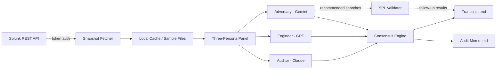

# Audit Evidence Auto-Compiler

> **Splunk Agentic Ops Hackathon 2026 — Security Track**
> An AI agent that pulls evidence from Splunk, runs a three-model panel debate, and produces audit-ready artifacts for SOC 2, ISO 27001, and NIST CSF.

## Quick start (30 seconds, zero Splunk required)

```bash
pip install -e .[splunk]
AEC_SAMPLE=soc2-cc61 aec_demo
```

```
$ aec_demo --sample soc2-cc61
[1/4] Loading snapshot: samples/soc2-cc61.json (1247 events, -30d to now)
[2/4] Running panel debate (3 personas, parallel)…
      [Rich TUI: 3 columns, real-time persona reasoning streams]
[3/4] Consensus: FAIL — adversary surfaced: 17% of logins bypass MFA
[4/4] Wrote out/transcript_2026-05-24T144320Z.md
      Wrote out/audit_memo_2026-05-24T144320Z.md
Done in 23s.
```

## Why this exists

vCISO consultants spend 40+ hours per SOC 2 audit cycle hand-pulling evidence from Splunk and reformatting it into auditor-acceptable artifacts. This agent does it in one prompt.

## What makes this different

Two things you won't find in a single-LLM "ask Splunk a question" agent:

1. **A three-agent panel — Claude, GPT, and Gemini — debates every finding.** Anthropic's Claude plays the Auditor (reads the control language literally). OpenAI's GPT plays the Engineer (reads the SPL for soundness). Google's Gemini plays the Adversary (tries to disprove the PASS verdict and proposes counter-searches). Three independently-trained models from three vendors, running in parallel. Consensus rule: lowest verdict wins — a single dissenting critic forces PARTIAL or FAIL. The full debate transcript ships with the report.
2. **The audit trail is tamper-evident.** Every snapshot in `audit_trail.jsonl` is SHA-256-chained to the previous one. The xlsx carries the chain root in a `Manifest` sheet. `aec verify gap_report.xlsx` detects any post-hoc edit in under 2 seconds.

The agent shows its work, and the work can't be silently rewritten.

## Architecture



**Splunk transport: REST API with token auth today.** MCP integration is future work — see [docs/splunk-setup.md](docs/splunk-setup.md).

See [ARCHITECTURE.md](ARCHITECTURE.md) for component detail.

## What it does

1. **Splunk snapshot** — connects to Splunk via REST API (bearer token auth), executes SPL, and captures evidence as a structured snapshot. Caches locally for deterministic reruns.
2. **Control mapping layer** — translates `"SOC 2 CC6.1"` or `"NIST CSF PR.AC-1"` into the specific internal controls and evidence types required, using a curated prior built from 89 production vCISO templates.
3. **SPL validator** — blocks empty or malformed follow-up searches and destructive commands (`| delete`, `| outputlookup`) *before* anything hits Splunk. Rejection becomes transcript evidence with a clear reason.
4. **Panel debate** — three personas (Auditor, Engineer, Adversary) critique the evidence in parallel; lowest-of-three verdict wins; transcript persists.
5. **Adversary follow-up** — the Adversary persona proposes counter-searches; when `AEC_RUN_ADVERSARY_SEARCHES=true` and a live Splunk client is available, these execute automatically and results appear in the transcript.
6. **Evidence formatter** — drops results into the same Audit Findings Remediation Tracker xlsx format that real audit committees already use; gap findings get severity, root cause, and LLM-drafted remediation.
7. **Merkle chain sealer** — SHA-256-chains every snapshot, embeds the chain root in the xlsx Manifest sheet. `aec verify` proves nothing has been edited post-collection.

## Install

```bash
# Basic (uses pre-canned samples, no live Splunk)
pip install -e .

# Stable Splunk install target; current transport uses requests.
pip install -e .[splunk]
```

## Quick start

```bash
# 1. Install
uv venv && source .venv/bin/activate
uv pip install -e .

# 2. Run with sample data (no Splunk needed)
aec_demo --sample soc2-cc61

# 3. Or debug without LLM calls
aec_demo --sample soc2-cc61 --no-llm
```

## Bring your own Splunk

```bash
# Set credentials
export SPLUNK_HOST="https://your-splunk:8089"
export SPLUNK_TOKEN="your-bearer-token"

# Test connectivity
python -m aec.splunk.client --probe

# Run against live Splunk
aec_demo --control CC6.1 --window 30d
```

See [docs/splunk-setup.md](docs/splunk-setup.md) for token provisioning, required permissions, and example SPL queries.

## Sample snapshots

Three pre-canned Splunk snapshots ship in `samples/`:

| Sample | Framework | Control | Key finding |
|--------|-----------|---------|-------------|
| `soc2-cc61` | SOC 2 | CC6.1 | 17% MFA bypass rate |
| `soc2-cc72` | SOC 2 | CC7.2 | 1 open critical incident |
| `iso27001-a921` | ISO 27001 | A.9.2.1 | 7 privilege escalations without approval |

These are the primary demo experience. Use `--sample <name>` to run without a live Splunk instance.

## Open-source artifact: vCISO Control Mapping Library

Even if you don't use the agent, the [`src/aec/priors/catalog.json`](src/aec/priors/catalog.json) file is a standalone library mapping ~36 internal cybersecurity controls across **ISO 27001, NIST 800-53, NIST CSF, SOC 2, and COBIT**, each tagged with the Splunk evidence patterns required to prove compliance. Derived from real consulting engagements; sanitized for open distribution.

## Why INSUFFICIENT outranks FAIL in consensus

When the three personas disagree, the panel picks the **most conservative** verdict
(lowest-of-three / max severity). Severity order:

    PASS < PARTIAL < FAIL < INSUFFICIENT

INSUFFICIENT means "the evidence doesn't let me determine pass/fail."
FAIL means "I can determine, and it fails."

We rank INSUFFICIENT higher than FAIL because:

1. An audit submission with insufficient evidence requires gathering more data —
   this is a stronger signal to the operator than a clear FAIL (which has a
   known remediation).
2. Asymmetric error cost: shipping a "PASS" when reality is INSUFFICIENT is
   worse than shipping "FAIL" when reality is PASS. Both are wrong; the first
   hides the gap.

Operators who want INSUFFICIENT to NOT dominate can configure via
`AEC_INSUFFICIENT_OVERRIDES_FAIL=false` (sets INSUFFICIENT severity equal to
PARTIAL, so a clear FAIL wins).

## Demo

3-minute video: [link forthcoming]

## License

Apache-2.0. See [LICENSE](LICENSE).

## Author

[Veera Sandiparthi](mailto:reachveera2024@gmail.com), AccessQuint LLC — vCISO consultancy, Pleasanton CA.
