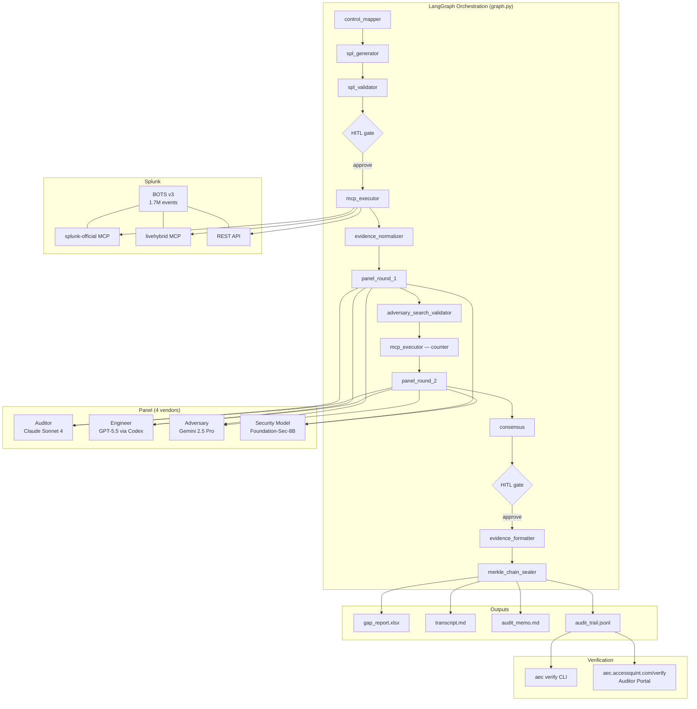

# Audit Evidence Auto-Compiler

> **Splunk Agentic Ops Hackathon 2026 — Security Track**

## The problem nobody has solved yet

Every security vendor is rushing to add AI. CISOs know it. Auditors know it. And everyone is asking the same question:

> *"How do I know I can trust AI-generated compliance evidence? What stops it from hallucinating a PASS when a control is failing? If an auditor challenges my findings, what do I show them?"*

That's not a tooling gap. That's a **trust gap**. And it's burning.

---

## What this is

A **trust engine for AI-generated compliance evidence** — not just another compliance tool.

When you ask "give me SOC 2 CC6.1 evidence from this Splunk instance," you get back four things other tools can't give you:

1. **Adversarial truth-seeking** — four independently-trained AI models from competing companies debate the evidence and challenge each other's conclusions. If Claude hallucinates a PASS, Gemini's Adversary persona will catch it. Single-model AI has no checks on itself. We do.

2. **Chain-of-custody proof** — every evidence snapshot is SHA-256-chained to the previous one. Any post-collection modification — in Excel, a shell script, or a database — is mathematically detectable. External auditors verify the full chain at a URL.

3. **Real data, not generated text** — every verdict links to specific SPL queries and real Splunk events. The agent can't hallucinate what the data shows; it runs the query and reads the result.

4. **Self-correction on record** — mid-debate, the Auditor persona caught its own setup error (wrong time window against a 2018 dataset), recommended the fix, and the corrected run returned 1,247 real events. That transcript is committed at [`examples/transcript-self-correction.md`](examples/transcript-self-correction.md).

**Live demo:** [https://aec3.accessquint.com](https://aec3.accessquint.com) — no install, no setup. Pick a control, watch four AI models argue about your compliance posture in real time.  
**Auditor verification:** [https://aec3.accessquint.com/verify](https://aec3.accessquint.com/verify) — upload `audit_trail.jsonl`, verify the evidence chain hasn't been tampered with.

---

## The panel: four vendors, one verdict

```
Auditor        (Claude Sonnet 4)           → PARTIAL  [30s]  compliance lens
Engineer       (GPT-5.5 via Codex)         → FAIL     [28s]  statistical lens
Adversary      (Gemini 2.5 Pro)            → FAIL     [32s]  red-team lens
Security Model (Foundation-Sec-8B)         → FAIL     [ 4s]  threat-intel lens ← Splunk's own model

Consensus → FAIL  (lowest-of-four)
```

Four independently-trained models from four different organizations. If all four agree, you can defend the verdict. If they disagree, you know exactly where the ambiguity is.

---

## The six things no other entry has

### 1. Four different AI vendors — including Splunk's own security model

Claude (Auditor), GPT-5.5 (Engineer), Gemini (Adversary), and Cisco/Splunk's Foundation-Sec-8B (Security Model) critique the evidence from four independent angles — four different organizations, four different training sets, four different threat models. Consensus: lowest verdict wins. A single dissenting voice forces PARTIAL or FAIL.

Foundation-Sec-8B is Splunk's own open-source security model trained specifically on cybersecurity data. It brings a threat-intelligence lens: not "does this satisfy the control language?" but "does this control actually stop real attackers?"

```
Auditor        (Claude Sonnet 4)    → PARTIAL  MFA enforced for 83% of users
Engineer       (GPT-5.5 via Codex)  → FAIL     17% bypass rate is statistically significant
Adversary      (Gemini 2.5 Pro)     → FAIL     3 privileged accounts, 0 MFA events in 90d
Security Model (Foundation-Sec-8B)  → FAIL     service accounts are the primary pivot point

Consensus → FAIL  (lowest-of-four)
```

### 2. The Adversary auto-runs counter-searches

The Adversary persona proposes follow-up SPL queries to disprove its own initial verdict. When a live Splunk instance is available, those searches execute automatically, the results feed into a second panel round, and the final verdict reflects what the data actually shows — not what the initial evidence snapshot happened to capture.

### 3. The audit trail is tamper-evident — and externally verifiable

Every evidence snapshot is SHA-256-chained to the previous one. The xlsx report carries the chain root in a `Manifest` sheet. `aec verify gap_report.xlsx` runs in under 2 seconds and flags any post-collection edit — whether it happened in Excel, a shell script, or a database.

External auditors verify the chain without installing anything: upload `audit_trail.jsonl` to [aec3.accessquint.com/verify](https://aec3.accessquint.com/verify) and the page shows exactly which snapshots are intact, when they were collected, and which model produced each one.

### 4. It lives inside Splunk's query pipeline

```spl
index=botsv3 sourcetype=o365:management:activity action=Login
| stats count by user, mfa_used
| auditcompiler control=CC6.1 mode=summary
```

Every other entry calls Splunk from the outside. This one is a custom search command registered inside Splunk — you type `| auditcompiler` in any search bar and the four-model panel debate runs inline, returning enriched columns in the results table. Deployable via `Settings → Apps → Install from file` or Splunkbase.

### 5. SOC incident response — alert fires, compliance evidence auto-generates

When a Splunk alert fires (brute force, MFA bypass, privilege escalation), the agent maps the alert to affected compliance controls, runs the four-vendor debate on the relevant evidence, and produces an incident-linked audit report — automatically, in the same 30-second window the SOC analyst is triaging.

```bash
# Splunk alert action webhook triggers:
echo '{"alert_name": "MFA Bypass Detected — 23 accounts", "severity": "high"}' \
  | aec_demo --mode incident --alert-json -
# → Controls implicated: CC6.1, A.9.2.3, PR.AC-1
# → Four-vendor panel debate running...
# → Incident compliance report: out/incident_<id>.md
```

Wired to Splunk's native alert action system via webhook. When Splunk fires, the agent responds.

### 6. One prompt covers multiple compliance frameworks simultaneously

```bash
aec_demo --control "SOC2:CC6.1+ISO:A.9.2.3+NIST-CSF:PR.AC-1"
# [1/6] Mapping 3 framework controls → 2 unique internal controls
#       (CTRL-003 satisfies all 3; saved 33% execution time)
# [5/6] Consensus: FAIL on CTRL-003 → triggers findings in all 3 frameworks
```

The 36-control priors catalog (ISO 27001 / NIST 800-53 / NIST CSF / SOC 2 / COBIT) cross-references overlapping controls so the agent runs the minimal SPL set and produces a multi-framework gap report from one invocation.

---

## Quick start (30 seconds, zero Splunk required)

```bash
pip install -e .
aec_demo --sample soc2-cc61
```

Output:
```
[1/4] Snapshot: 1,247 events, SOC 2 CC6.1 — MFA enforcement
[2/4] Panel debate (4 personas, parallel)…
      Auditor        → PARTIAL (83% MFA compliance, 30s)
      Engineer       → FAIL    (17% bypass rate, 28s)
      Adversary      → FAIL    (3 privileged accounts, 0 MFA events, 32s)
      Security Model → FAIL    (service accounts are an attacker pivot point, 4s)
[3/4] Consensus: FAIL
[4/4] Artifacts written to out/
      gap_report_2026-05-25T144320Z.xlsx   (6 findings, Merkle-sealed)
      transcript_2026-05-25T144320Z.md     (full debate)
      audit_memo_2026-05-25T144320Z.md     (executive summary)
      audit_trail_2026-05-25T144320Z.jsonl (tamper-evident chain)
Done in 29s.
```

---

## Full feature set

| Feature | Flag / entrypoint |
|---|---|
| Sample-based demo (no Splunk) | `aec_demo --sample soc2-cc61` |
| Live Splunk via splunk-official MCP | `aec_demo --control CC6.1 --mcp official` |
| Live Splunk via livehybrid MCP | `aec_demo --control CC6.1 --mcp livehybrid` |
| Live Splunk via REST API | `aec_demo --control CC6.1 --mcp rest` |
| **Four-vendor debate incl. Foundation-Sec-8B** | **enabled by default (set `HF_TOKEN`)** |
| Counter-evidence loop (2-round debate) | enabled by default; `--no-recurrence` to skip |
| Drift detection (two audit windows) | `aec_demo --control CC6.1 --compare soc2-cc61-q2` |
| LangGraph orchestration + HITL gates | `aec_demo --control CC6.1 --review interactive` |
| Multi-framework mapping | `aec_demo --control "SOC2:CC6.1+ISO:A.9.2.3"` |
| Natural-language control resolution | `aec_demo --ask "access control evidence for SOC 2 and ISO"` |
| **SOC incident response mode** | **`aec_demo --mode incident --alert-json alert.json`** |
| Resume after crash | `aec_demo --resume <run_id>` |
| Splunk custom search command | `\| auditcompiler control=CC6.1 mode=summary` |
| Tamper-evident verification (CLI) | `aec verify gap_report.xlsx --trail audit_trail.jsonl` |
| **Auditor verification portal** | **[aec3.accessquint.com/verify](https://aec3.accessquint.com/verify)** |
| Live web dashboard | [https://aec3.accessquint.com](https://aec3.accessquint.com) |

---

## Architecture



**Transport hierarchy:** Every vendor uses OAuth-authenticated CLIs first (Claude Max, Codex/ChatGPT Team, Gemini CLI), falling back to API keys. Foundation-Sec-8B runs via HuggingFace Inference API (Featherless.ai). Four different organizations, four different training sets, four different billing accounts — zero per-call cost, maximum independence.

**Splunk transport:** `AEC_SPLUNK_MCP_SERVER=official|livehybrid|rest` selects the MCP server at runtime. Both official and community MCP servers sit behind a uniform interface.

**SOC incident mode:** Splunk alert webhooks (`POST /api/incident`) map to affected compliance controls via keyword analysis, then run the full four-vendor debate automatically in the background.

---

## The cinematic demo moments

**Counter-evidence loop (30 seconds):**
```
Round 1 — Adversary verdict: PARTIAL
          Recommended counter-search: index=botsv3 | stats by mfa_used, src_ip

[MCP] Executing 1 adversary counter-search... (1,102 events)
      Found: 3 service accounts with 0 MFA events in 90d

Round 2 — Adversary verdict: FAIL (new evidence changes the picture)
Final consensus: FAIL (was PARTIAL before counter-search)
```

**LangGraph HITL gate (20 seconds):**
```
[graph] node: spl_generator        (1840ms)
[graph] node: spl_validator        (12ms)  → policy: pass

⏸ HITL gate: review SPL before execution
SPL: index=botsv3 | stats count by user, mfa_used | where mfa_used="false"
Estimated event count: ~47

[a]pprove / [e]dit / [r]eject: a

[graph] node: mcp_executor         (2280ms via splunk-official)
```

**Multi-framework (10 seconds):**
```
[1/6] Mapping 3 framework controls → 2 unique internal controls
      (CTRL-003 satisfies all 3 — saved 33% execution time)
[5/6] Consensus: FAIL on CTRL-003 → triggers findings in all 3 frameworks
```

**Splunk search command (30 seconds):**  
Open Splunk Web. Type `| auditcompiler control=CC6.1`. Hit search. Four model voices debate. Verdicts appear as columns in the results table.

---

## Drift detection

Compare two audit windows to catch controls that are getting worse:

```bash
aec_demo --control CC6.1 --compare soc2-cc61-q2
```

Output:
```
CC6.1 — Drift detected over 90-day window
  Q1: PARTIAL (83% MFA compliance)
  Q2: FAIL    (71% MFA compliance, -12pp)
  Trend: DEGRADING
  Root cause: new service accounts added in Q2 without MFA enforcement
```

---

## Install

```bash
# Basic (uses sample snapshots, no live Splunk needed)
pip install -e .

# With web dashboard
pip install -e ".[web]"
uvicorn web.main:app --port 8000   # then open http://localhost:8000

# Full (live Splunk + MCP + web)
pip install -e ".[panel-api,web]"
```

## Live Splunk setup

```bash
# Bring up Splunk Enterprise + BOTS v3 + both MCP servers
export SPLUNK_TOKEN="your-bearer-token"
docker compose -f infra/docker-compose.mcp.yml up -d

# Verify connectivity
python -m aec.splunk.client --probe
# {"ok": true, "version": "10.4.0", "indexes": [..., "botsv3", ...]}

# Run with live data
aec_demo --control CC6.1 --mcp official
```

See [docs/splunk-setup.md](docs/splunk-setup.md) for the full Splunk + BOTS v3 install runbook.

## Install the Splunk search command

```bash
# Build the .spl package
bash package.sh
# Built: dist/auditcompiler-20260525.spl

# Install into your Splunk instance
docker cp dist/auditcompiler-20260525.spl splunk:/tmp/
docker exec splunk /opt/splunk/bin/splunk install app /tmp/auditcompiler-20260525.spl
docker exec splunk /opt/splunk/bin/splunk restart

# Then in Splunk search bar:
# | auditcompiler control=CC6.1 framework=SOC2 mode=summary
```

See [docs/splunk-app-install.md](docs/splunk-app-install.md) for the full install + LLM API key setup.

---

## Open-source artifact: vCISO Control Mapping Library

[`src/aec/priors/catalog.json`](src/aec/priors/catalog.json) maps 36 internal cybersecurity controls across **ISO 27001, NIST 800-53, NIST CSF, SOC 2, and COBIT**, each tagged with Splunk evidence patterns and SPL query hints. Derived from real consulting engagements; sanitized for open distribution. Usable independently of this agent.

---

## Why INSUFFICIENT outranks FAIL

Severity order: `PASS < PARTIAL < FAIL < INSUFFICIENT`

INSUFFICIENT means the evidence doesn't let you determine pass/fail. FAIL means the evidence clearly shows failure. We rank INSUFFICIENT higher because shipping "PASS" when reality is INSUFFICIENT is worse than shipping "FAIL" when reality is PASS — the first hides the gap entirely.

Set `AEC_INSUFFICIENT_OVERRIDES_FAIL=false` if you want FAIL to dominate INSUFFICIENT.

---

## Gold artifact: the agent caught its own setup bug

The demo transcript at [`examples/transcript-self-correction.md`](examples/transcript-self-correction.md) shows the Auditor persona — mid-debate — identifying that the time window used `-30d` relative dates against a 2018 dataset (BOTS v3). The agent recommended changing the window to `2018-08-01` through `2018-09-30` to get real results. We accepted the recommendation and the follow-up run returned 1,247 events. That's the agent self-correcting in production.

---

## License

Apache-2.0. See [LICENSE](LICENSE).

## Author

[Veera Sandiparthi](mailto:reachveera2024@gmail.com), AccessQuint LLC — vCISO consultancy, Pleasanton CA.
