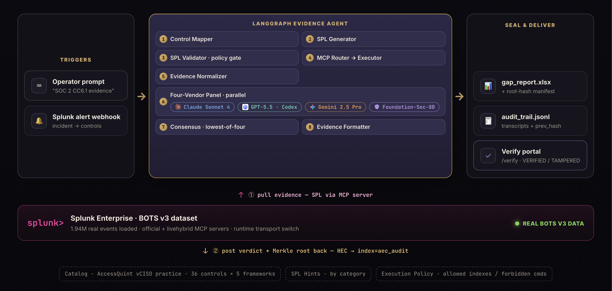
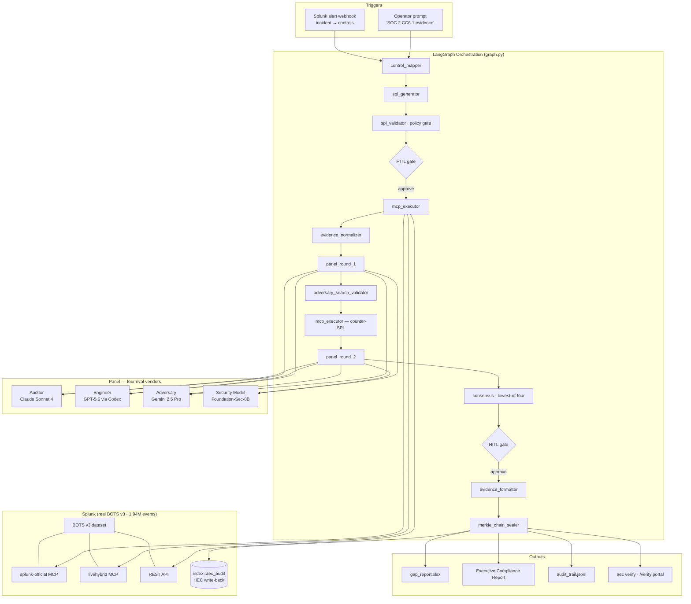

# Architecture Diagram — Audit Evidence Auto-Compiler (Tessera)

One LangGraph agent pulls real Splunk data, puts it in front of four rival AI vendors, reconciles their
verdicts mechanically, and seals the result in a tamper-evident Merkle chain — then writes the verdict
back into Splunk.

## Pipeline (LangGraph)

## Notes

- **Consensus is mechanical** — severity ordering `PASS < PARTIAL < FAIL < INSUFFICIENT`, lowest verdict
  wins, no LLM tiebreaker. Fully reproducible.
- **Splunk transport is pluggable** at runtime: `AEC_SPLUNK_MCP_SERVER=official|livehybrid|rest`.
- **Evidence is tamper-evident** — each snapshot is SHA-256 hashed over canonical JSON and chained;
  `aec verify` (or the public `/verify` portal) recomputes the chain to detect any post-collection edit.
- **Four organizations, four training sets** — Claude (Anthropic), GPT-5.5 (OpenAI), Gemini (Google),
  Foundation-Sec-8B (Cisco/Splunk, via Hugging Face / Featherless.ai) — for maximum independence.

See [`README.md`](README.md) for the full feature set and run instructions.
